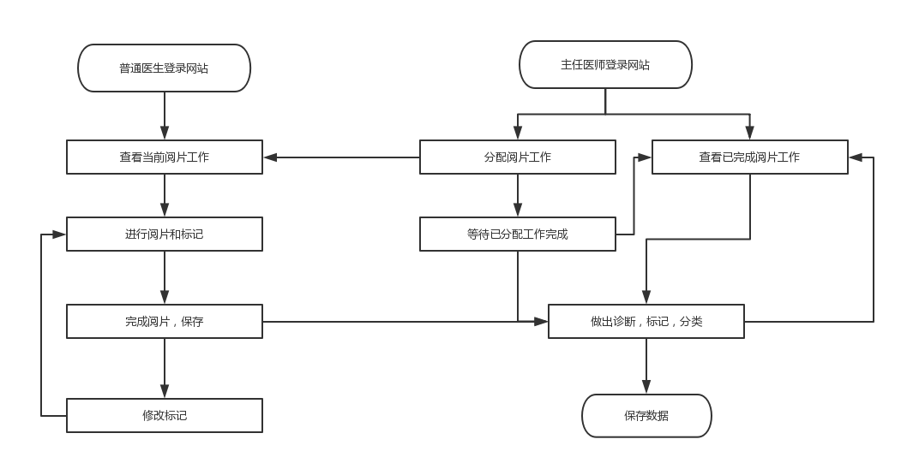

# Investigation

### 相关产品与发展综述

医学影像是指为了医疗或医学研究，对人体或人体某部分，以非侵入方式取得内部组织影像的技术与处理过程。目前，仍然有许多医院处于纸质办公阶段，特别是对于医学影像的查阅。对于医生的工作而言，使用医学影像胶片的工作流往往很大程度上限制了医生的工作效率。例如，现有一张医学影像，需要分别送到两位医生的手上，进行标记和诊断，则需要经过以下过程：

```
影像科印制胶片 --> 送交A医生 --> A医生进行诊断和标记 --> 送交B医生 --> B医生进行诊断和标记 --> 送交主任医师 --> 主任医生根据诊断和标记分析影像 --> 记录数据
```

显然，浪费了大量办公时间，效率被大幅度限制。

### 产品的市场(客户)定位

本产品面向医院内部，客户为医院内部的所有医生。根据他们的职责可以分为三类：主任医师，普通医生，影像数据管理员。

面对以上三类客户，我们分别定制了相对应的，易于使用的服务:

- 普通医生。普通医生需要借助系统来完成所有网上阅片的任务。所有普通医生都可以注册自己的账户，用于**普通用户**权限，可以在医院内部网站上方便第查看影像，标记影像，以及管理所有分配给自己的影像。


- 主任医生。主任医生需要借助系统来分配和管理医学影像，他们可以将影像分发给普通医生，并且最后获取他们的诊断记录和标记。主任医师会获得**高级用户**权限，便于管理工作。
- 影像数据管理员。影像数据管理员需要利用该系统完成对数据库中所有影像资料，患者资料的管理。

### 典型业务流程



### 可能存在的新机遇

除了提供基本的阅片功能外，医院还有更多其它方面的需求。

例如，很多图片的预处理，只需要很简单的功能和实现。但是目前，医院内部所有的影像处理都需要交由影像科处理。例如，一个简单的直方图均衡化效果，也需要交由影像科，且往往等待时间较长。针对这一现象，我们预根据医院需求，在客户端/服务器上提供一些简单的医学影像处理功能，提高阅片效率。

另一方面，医生对于医学影像图片的标注功能也存在大量需求。这也是很大一部分医院仍然使用胶片来处理医学影像的原因。目前的大部分医学影像处理系统，对于标记功能略显疲乏，医生无法舒适地在图像上完成标记。因此，我们也预计为此系统提供美观，简便，人性化的图像标记功能。