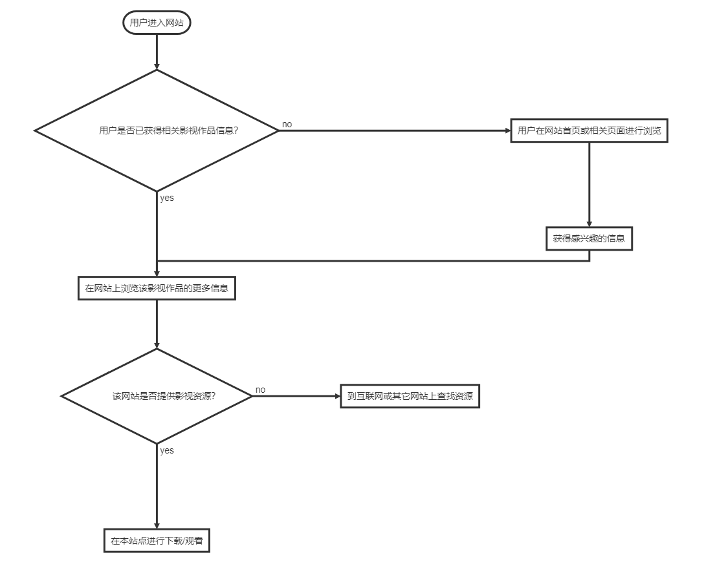

# Investigation

### 相关产品与发展综述

关于影视信息的产品在**形式**上可以分**影视网站**和**影视APP**两类。它们提供的服务主要是：

- **信息汇聚**。大部分的电影，剧集，动画等信息都可以在网站/应用中搜索到，且有关于影视作品的详细介绍，如背景故事，演员表，所获奖项等。
- **打分与评论/讨论系统**。用户可以为一部影视作品打分，也可以在相关讨论区发表自己的看法。网站/APP也以此建立了自己的社交系统。
- **影视作品在线观看/下载功能**。部分网站不仅提供作品介绍，还提供在线观看或直接的下载资源。但是，此类网站以盗版资源居多，或者是绑定自家的播放器并插入大量广告。只有少数的有大公司支持的网站，才有足够的财力来获取大量的正版资源版权。

- 影视网站
- 影视APP

### 值得关注的竞争产品 

- 网站
  - [IMDB](http://www.imdb.com/)。老牌**影视信息网站**，IMDb上有丰富的**电影作品信息**，包括影片演员、导演、剧情，影评这类的基本信息，也有更深层的内容，比如影片相关的琐事花絮，片中出现的漏洞，影片音轨，屏幕的高宽比，影片的不同版本等等。演员，导演，作者和其他工作人员都在数据库中有自己的条目，其中列出他们参加过的影片，通常还有他们的传记。还提供**每日更新的电影电视新闻**，以及为不同电影活动比如奥斯卡奖推出特别报道。
  - [Rotten Tomatoes(烂番茄)](https://www.rottentomatoes.com/)。一个以提供电影、电子游戏及电视节目的相关**评论、资讯和新闻**为主的网站。该网站主打的是**评论**系统，烂番茄的工作人员会搜寻各个网站上刊载的特定电影或游戏评论，不论是业余还是专业的。一旦搜寻到之后，工作人员使用整合资料来决定评论是正面（新鲜，以一个鲜红的番茄作为标记）或负面（腐烂，以一个绿色被砸烂的番茄作为标记）。许多想看电影的观众，都会参考这个网站，例如苹果iTunes Store和Google Play电影也会加以链接评价，以便大家参考。
  - [电影天堂](https://www.dygod.net/)。国内知名电影下载网站，虽然充斥着盗版资源，但是挺过了一波又一波风浪。主要提供的服务就是**下载服务**，且是直接链接（其它大部分网站提供的观看资源会绑定到优酷，爱奇艺等正版网站链接）。
- APP
  - 豆瓣APP。同时也是知名推荐网站。用户基数大，在国内知名度高，打分系统也是很多用户选择影视作品的重要标准。同时，网站用于很多知名影评人用户，他们的影评等文章往往能够对一部电影的评价产生一定影响，也能吸引大量用户参与讨论。产品主要关注**电影**。
  - iTV Shows 3。国外APP，售价18元。在国内普遍知名度不高，但是在喜欢美剧的用户中深受喜爱，口碑很好。APP内不仅提供各类美剧信息，同时有追剧进度跟踪，剧集更新提醒等功能，很大程度上满足了热爱追剧的用户需求。

### 相关产品的市场(客户)定位

总体而言，相关产品的市场定位可以分为两大类：

- **信息类**
- **资源类**

**信息类**产品主要提供的是影视作品信息，并且通过更复杂的社交系统将用户与信息融合。**资源类**产品往往不会提供推荐功能，即用户通常是得到了信息后，再通过该类产品搜索资源。

### 典型业务流程

### 可能存在的新机遇

在进行了客户调研之后，我们了解到，所有喜爱影视作品的用户目前面临的最大需求是：

**当一部剧集看完，或者当前没有热门电影时，找不到适合自己口味的新剧集和电影**

即，用户缺少的，是一个**推荐**系统。

那么，当前各大网站/APP是否缺乏推荐系统呢？答案是否定的，大部分大型网站都会根据用户行为采集信息，例如用户最经常浏览的影视作品类别，演员等。每个视频播放完，也会有类似“猜你喜欢”等推荐出现。不仅如此，很多网站的评论区，都会有大量网友参与交流，互相推荐剧集等。

对于这些推荐，用户的反馈是：

- 网站/APP的智能推荐，往往不合胃口。
- 各个大型网站的首页推荐，很可能是当下最热门的，但是完全不是自己喜欢的。
- 约60%的用户在观看完影视作品之后，不会留意评论区。约80%的用户从未在评论区发表评论。以上评论区不包括弹幕系统。
- 一些用户认为，自己真正下载资源的网站，甚至是自己的搜索引擎，才拥有正确的数据。在一部影视作品的介绍界面停留，并不代表自己对它的喜好，真正的观看/下载，才是正确的数据来源。

因此，对于我们的产品，力求实现以下两点要求：

1. **简洁，方便的评价系统**
2. **智能推荐系统**

初步计划，建立类似于*steam*商店的**探索队列**功能。