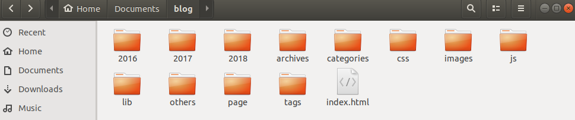
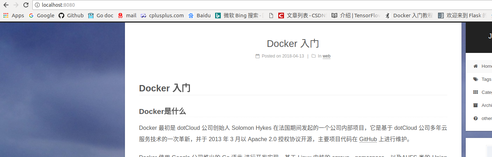

# Docker 入门实战

> 王治鋆 15331304
>
> Docker 入门，学习与实践记录

## Docker基础知识

### Docker是什么

Docker 最初是 dotCloud 公司创始人 Solomon Hykes 在法国期间发起的一个公司内部项目，它是基于 dotCloud 公司多年云服务技术的一次革新，并于 2013 年 3 月以 Apache 2.0 授权协议开源，主要项目代码在 [GitHub](https://github.com/moby/moby) 上进行维护。

Docker 使用 Google 公司推出的 [Go 语言](https://golang.org/) 进行开发实现，基于 Linux 内核的 [cgroup](https://zh.wikipedia.org/wiki/Cgroups)，[namespace](https://en.wikipedia.org/wiki/Linux_namespaces)，以及[AUFS](https://en.wikipedia.org/wiki/Aufs) 类的 [Union FS](https://en.wikipedia.org/wiki/Union_mount) 等技术，对进程进行封装隔离，属于 [操作系统层面的虚拟化技术](https://en.wikipedia.org/wiki/Operating-system-level_virtualization)。由于隔离的进程独立于宿主和其它的隔离的进程，因此也称其为容器。

Docker 在容器的基础上，进行了进一步的封装，从文件系统、网络互联到进程隔离等等，极大的简化了容器的创建和维护。使得 Docker 技术比虚拟机技术更为轻便、快捷。

### 为什么要用Docker

环境配置一直是软件开发的麻烦之一。用户计算机的环境都不相同，同样的软件，换了一台机器可能根本无法运行。环境包括操作系统的设置，各种库和组件的安装。只有它们都正确，软件才能运行。举例来说，安装一个 Python 应用，计算机必须有 Python 引擎，还必须有各种依赖，可能还要配置环境变量。

环境配置如此麻烦，换一台机器，就要重来一次，让人身心俱疲。那么，软件可不可以附带环境安装？也就是说，安装的时候，能否把可运行的原始环境复制过来？ Docker就是来解决这个问题的。

### Docker 与 虚拟机

这么听起来，Docker与虚拟机好像是一个东西。确实，它们都是带环境安装的不同解决方案，然而，虚拟机有以下几个劣势：

- 资源占用多

  虚拟机会独占一部分内存和硬盘空间。它运行的时候，其他程序就不能使用这些资源了。哪怕虚拟机里面的应用程序，真正使用的内存只有 1MB，虚拟机依然需要几百 MB 的内存才能运行。

- 冗余步骤多

  虚拟机是完整的操作系统，一些系统级别的操作步骤，往往无法跳过，比如用户登录。

- 启动慢

  启动操作系统需要多久，启动虚拟机就需要多久。可能要等几分钟，应用程序才能真正运行。

由于虚拟机存在这些缺点，Linux 发展出了另一种虚拟化技术：Linux 容器（Linux Containers，缩写为 LXC）。**Linux 容器不是模拟一个完整的操作系统，而是对进程进行隔离。**显然，直接对进程隔离，容器的几大优势就体现出来了：

- 启动快
- 资源占用少
- 体积小

**Docker 属于 Linux 容器的一种封装，提供简单易用的容器使用接口。**它是目前最流行的 Linux 容器解决方案。

虚拟机与Docker对比：


### 安装Docker

以下以ubuntu17.10为例，安装Docker社区版(Docker CE)，

ubuntu16.04版本以下的安装可能略有不同，详见[Get Docker CE for Ubuntu](https://docs.docker.com/install/linux/docker-ce/ubuntu/#supported-storage-drivers)

首先，如果需要卸载旧版Docker:

```shell
$ sudo apt-get remove docker docker-engine docker.io
```

在一台新主机上安装Docker时，官方推荐使用Docker仓库来安装，此后可以很方便地从仓库安装和更新Docker。由于 `apt` 源使用 HTTPS 以确保软件下载过程中不被篡改。因此，我们首先需要添加使用 HTTPS 传输的软件包以及 CA 证书。

```shell
$ sudo apt-get update
$ sudo apt-get install apt-transport-https ca-certificates curl software-properties-common
```

添加Docker官方的GPG秘钥：

```shell
$ curl -fsSL https://download.docker.com/linux/ubuntu/gpg | sudo apt-key add -
```

验证秘钥

```shell
$ sudo apt-key fingerprint 0EBFCD88
```

能看到包含`9DC8 5822 9FC7 DD38 854A  E2D8 8D81 803C 0EBF CD88`的输出就证明正确的安装了Docker CE的秘钥。

安装Docker时，可以直接选择安装最新版本：

```shell
sudo apt-get install docker-ce
```

也可以指定版本：

```shell
$ sudo apt-get install docker-ce=<VERSION>
```

如果需要查看可用版本：

```shell
$ apt-cache madison docker-ce
```

就是列出版本，版本号等信息。例如，我的输出如下：

```shell
 docker-ce | 18.03.0~ce-0~ubuntu | https://download.docker.com/linux/ubuntu artful/stable amd64 Packages
 docker-ce | 17.12.1~ce-0~ubuntu | https://download.docker.com/linux/ubuntu artful/stable amd64 Packages
 docker-ce | 17.12.0~ce-0~ubuntu | https://download.docker.com/linux/ubuntu artful/stable amd64 Packages
```

### Docker Hello world

```shell
$ sudo docker run hello-world
```

docker会首先从本地查找`hello-world`镜像：

```shell
Unable to find image 'hello-world:latest' locally
latest: Pulling from library/hello-world
```

当本地不存在这个镜像时，会尝试从远程仓库拉取镜像。

当然，由于某些众所周知的原因，你可能在拉取镜像的时候会遭遇以下错误：

```shell
9bb5a5d4561a: Pulling fs layer 
docker: error pulling image configuration: Get https://dseasb33srnrn.cloudfront.net/registry-v2/docker/registry/v2/blobs/sha256/e3/e38bc07ac18ee64e6d59cf2eafcdddf9cec2364dfe129fe0af75f1b0194e0c96/data?Expires=1523628504&Signature=aIcaKD3IHvC8tyfgtZqHiiXXiF-8GJLhWfT1u6biKk8GjxKD43LdJHzJRGF4XzkidUfObja-JDgcR97Zl7-IQYyjs-DBhpmnsr7EIUofErmCGM~fnU0fvlBJWyecQMbLYLrl-qDSph08StNv-DKYtsfnZOXbrfrTfSj-uLeyJBA_&Key-Pair-Id=APKAJECH5M7VWIS5YZ6Q: net/http: TLS handshake timeout.
See 'docker run --help'.
```

解决方法也很简单：

1. 科学地上网
2. 修改默认远程镜像仓库

Docker为中国也提供了官方的镜像库：https://registry.docker-cn.com

配置方法如下：

- Ubuntu 14.04、Debian 7 Wheezy

  ```shell
  sudo vim /etc/default/docker
  ```

  配置这么一行：

  ```shell
  DOCKER_OPTS="--registry-mirror=https://registry.docker-cn.com"
  ```

  之后，重启服务即可生效：

  ```shell
  $ sudo service docker restart
  ```

 - Ubuntu 16.04+、Debian 8+、CentOS 7

   ```
   sudo vim /etc/docker/daemon.json
   ```

   写入以下内容：

   ```json
   {
     "registry-mirrors": [
       "https://registry.docker-cn.com"
     ]
   }
   ```

   重启服务：

   ```shell
   $ sudo systemctl daemon-reload
   $ sudo systemctl restart docker
   ```


   

重新运行`hello-world`

```shell
$ sudo docker run hello-world
```

```shell
Unable to find image 'hello-world:latest' locally
latest: Pulling from library/hello-world
9bb5a5d4561a: Pull complete 
Digest: sha256:bbdaf0ed64b665f3061aeab15b946697dd00845161935d9238ed28e8cfc2581c
Status: Downloaded newer image for hello-world:latest

Hello from Docker!
This message shows that your installation appears to be working correctly.
```

此时，已经能够成功从国内镜像库拉取镜像了。


### 镜像，容器 与 仓库

Docker中最重要的三个基本概念就是**镜像(image)，容器(container) 与 仓库(Repository)**。详细介绍参见[Docker基本概念](https://yeasy.gitbooks.io/docker_practice/content/basic_concept/)

以刚才运行的`hello-world`为例。`hello-world:latest`是一个镜像，查看镜像：

```shell
$ sudo docker image ls
REPOSITORY          TAG                 IMAGE ID            CREATED             SIZE
hello-world         latest              e38bc07ac18e        32 hours ago        1.85kB
mysql               5.7                 5709795eeffa        5 months ago        408MB
```

命令`docker run hello-world`实际上是一个创建容器并启动的过程。

> 镜像（`Image`）和容器（`Container`）的关系，就像是面向对象程序设计中的 `类` 和 `实例` 一样，镜像是静态的定义，容器是镜像运行时的实体。容器可以被创建、启动、停止、删除、暂停等。

查看容器的命令如下：

```shell
$ sudo docker container ls
CONTAINER ID        IMAGE               COMMAND             CREATED             STATUS              PORTS               NAMES
```

但是，我们什么都没看到。这是因为，已经终止的容器，不会被列出。而`hello-world`的作用是**输出一个 “Hello World”，之后终止容器**。因此，此时该容器已经终止。加上`-a`参数可以查看已经终止的容器：

```shell
$ sudo docker container ls -a
CONTAINER ID        IMAGE               COMMAND             CREATED             STATUS                      PORTS               NAMES
50a8659057c2        hello-world         "/hello"            19 minutes ago      Exited (0) 19 minutes ago                       competent_jepsen
```

可以用`docker container rm [Container]`来删除一个处于终止状态的容器，也可以用`docker container prune`清理掉所有处于终止状态的容器。

镜像的更多操作：[使用 Docker 镜像](https://yeasy.gitbooks.io/docker_practice/content/image/)。容器的更多操作：[操作 Docker 容器](https://yeasy.gitbooks.io/docker_practice/content/container/)


## Docker nginx 实战入门

接下来，我们以个人博客为例，用docker+nginx部署自己的个人博客。其中，`nginx`的作用在这里只是一个静态文件服务器。

### 获取镜像

想要获取一个镜像，最简单的方法，就是查看是否已经有了满足要求的镜像。命令行查看：

```shell
$ sudo docker search nginx
NAME                                                   DESCRIPTION                                     STARS               OFFICIAL            AUTOMATED
nginx                                                  Official build of Nginx.                        8341                [OK]                
jwilder/nginx-proxy                                    Automated Nginx reverse proxy for docker con…   1316                                    [OK]
richarvey/nginx-php-fpm                                Container running Nginx + PHP-FPM capable of…   545                                     [OK]
jrcs/letsencrypt-nginx-proxy-companion                 LetsEncrypt container to use with nginx as p…   348                                     [OK]
kong                                                   Open-source Microservice & API Management la…   174                 [OK]                
webdevops/php-nginx                                    Nginx with PHP-FPM                              99                                      [OK]

```

当然，你也可以直接上官方镜像站的网页查看。

事实是，常用镜像，一般来说都会有很多优质镜像已经被搭建好。像`Nginx`这样的，还有官方（Official）镜像。可以直接拉取官方`nginx`镜像：

```shell
sudo docker pull nginx
```

当然，你也可以自己用`Dockerfile`[构建一个自己的镜像](https://yeasy.gitbooks.io/docker_practice/content/image/build.html)。


首先，假设你已经有了自己博客的所有静态文件（至少有一个`index.html`）



并且写好了`nginx`的配置文件`blog.config`，放在`/etc/nginx/sites-enabled/`下，就可以运行部署的命令了：

```shell
$ sudo docker run --name testNginx \ 
-d -p 8080:8080 \
-v /usr/docker/myNginx/blog:/home/ace/Documents/blog \
-v /usr/docker/myNginx/sites-enable:/etc/nginx/sites-enabled \
nginx
```

实际上是`docker run [FLAGS] nginx`

`-d`是`debug`模式，`-p`指定端口映射，即将容器的8080端口映射到主机的8080端口。

`-v`表示挂载，可以简单的理解为，当容器中的`nginx`运行时，是以`/usr/docker/myNginx/blog`为根目录提供静态文件的，那么这部分文件，就来源于主机的`/home/ace/Documents/blog`目录下，`.conf`文件的挂载同理。

容器开始运行后，在浏览器中访问`localhost:8080`，就可以看到你的博客了：




### FAQ

遇到错误中带有提示`TLS`或者`HTTP/HTTPS时`，配置了国内镜像库能解决80%的问题，*科学的上网*能解决90%的问题。

默认情况下，`docker` 命令会使用 [Unix socket](https://en.wikipedia.org/wiki/Unix_domain_socket) 与 Docker 引擎通讯。而只有 `root` 用户和 `docker` 组的用户才可以访问 Docker 引擎的 Unix socket。出于安全考虑，一般 Linux 系统上不会直接使用 `root` 用户。因此，为了避免每次输入命令都需要`sudo`，可以选择使用 `docker` 的用户加入 `docker` 用户组：

```shell
$ sudo usermod -aG docker $USER
```


