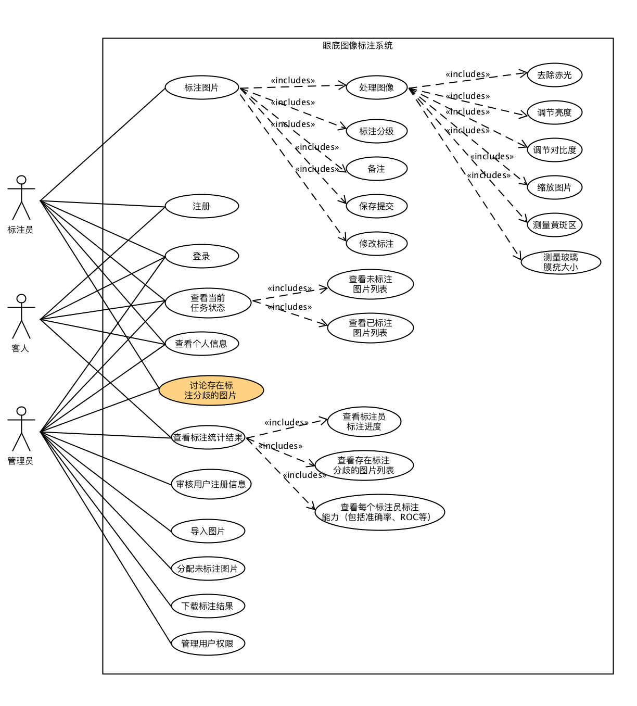

## 注册
级别：用户目标
主要参与者：标注员和客人
涉众及其关注点：

* 使用者注册成为标注员

前置条件：

* 注册记录必须通过管理员审核。

成功保证：

* 提交完善个人信息和正确的员工号。

主成功场景：

1. 邮件通知用户，审核获得通过。
2. 用户可以通过登录，进入系统，进行标注工作。

## 登录
级别：用户目标
主要参与者：标注员、客人和管理员
涉众及其关注点：

* 获得正确的登录反馈

前置条件：

* 用户名已经通过管理员审核。

## 审核用户注册信息
级别：用户目标
主要参与者：管理员
涉众及其关注点：

* 管理员：根据注册者提交的个人信息进行审核。

## 查看个人信息
级别：用户目标
主要参与者：标注员、客人和管理员
涉众及其关注点：

* 用户可以查看个人信息以及修改部分信息（如邮箱和照片等）。

## 管理用户权限
级别：用户目标
主要参与者：管理员
涉众及其关注点：

* 管理员可以管理当前用户权限。
* 管理员可以删除用户，使其无法进入系统。

## 导入图片
级别：用户目标
主要参与者：管理员
涉众及其关注点：

* 管理员可以批量上传图片，并表示为未标注数据。

## 分配未标注图片
级别：用户目标
主要参与者：管理员
涉众及其关注点：

* 管理员可以将目前未标注数据分配给标注员进行标注。

## 下载标注结果
级别：用户目标
主要参与者：管理员
涉众及其关注点：

* 管理员可以将已经标注好的图片与标签信息（csv保存）打包下载。

## 标注图片
级别：用户目标
主要参与者：标注员
涉众及其关注点：

* 标注员可以进行基本的图像处理操作，例如去除赤光、调节亮度、调节对比度、缩放图片、测量黄斑区和测量玻璃膜疣大小等。
* 标注员需要对图片进行标注分级
	* 1、判断图片质量。
		* 1a.如果图片质量不佳，则需要选择具体的原因。例如曝光问题、镜头污染、视野偏差、图像失焦和其他问题等。
		* 1b.如果图片质量尚可，则需要进行标注。
	* 2、判断是否有视网膜病变
		* 2a.如果不患有视网膜病变，则不再出现其他病记标注选项。
		* 2b.如果存在视网膜病变，则继续进行标注。
	* 3、判断糖尿病视网膜病变阶段
		* 3a.判断患者所处的患病阶段为1至7期中的一期。
	* 4、判断是否患有黄斑水肿
		* 4a. 判断不患有黄斑水肿
		* 4b. 判断为因为糖尿病引起的黄斑水肿。（糖尿病黄斑水肿）
		* 4c. 判断为不是因为糖尿病而引起的黄斑水肿。（非糖尿病黄斑水肿）
	* 5、判断是否患有高血压视网膜病变
		* 5a. 判断为不患有高血压视网膜病变
		* 5b. 判断所处阶段（轻度、中度和重度）
	* 6、判断是否患有年龄相关性黄斑变性
		* 6a.判断为不患有年龄相关性黄斑变性
		* 6b. 判断所处阶段（早期、中期和晚期）
	* 7、判断是否患有视网膜静态阻塞
	* 8、判断是否患有视网膜动态阻塞
	* 9、判断是否患有病理性近视
	* 10、判断是否患有视盘、视神经疾病
	* 11、判断是否患有疑似青光眼
	* 12、判断是否有其他疾病（可备注）
	* 13、备注
	
## 查看当前任务状态
级别：用户目标
主要参与者：客人、标注员与管理员
涉众及其关注点：

* 标注员可以查看自己已经标注的图片和未标注的图片列表。
* 管理员和客人可以查看目前系统中已标注和未标注的图片列表。

## 查看标注统计结果
级别：用户目标
主要参与者：管理员与客人
涉众及其关注点：

* 管理员和客人可以查看所有标注员标注进度。
* 可以查看存在标注分歧的图片列表。
* 可以查看每个标注员标注能力统计（包括准确率和ROC）

## 讨论存在标注分歧的图片
级别：用户目标
主要参与者：客人、标注员与管理员
涉众及其关注点：

* 类似于讨论区形式，参与者可以针对每张存在分歧的图片发起讨论。

