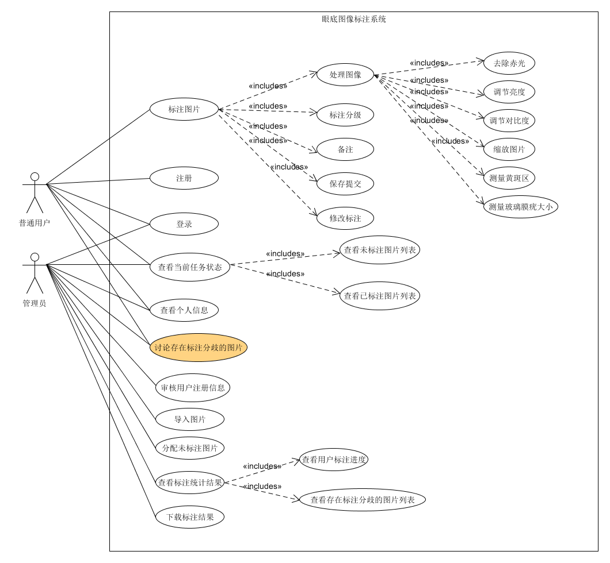

## 注册
级别：用户目标
主要参与者：标注员和客人
涉众及其关注点：

* 使用者注册成为标注员

前置条件：

* 注册记录必须通过管理员审核。

成功保证：

* 提交完善个人信息和正确的员工号。

主成功场景：

1. 邮件通知用户，审核获得通过。
2. 用户可以通过登录，进入系统，进行标注工作。

## 登录
级别：用户目标
主要参与者：标注员、客人和管理员
涉众及其关注点：

* 获得正确的登录反馈

前置条件：

* 用户名已经通过管理员审核。

## 审核用户注册信息
级别：用户目标
主要参与者：管理员
涉众及其关注点：

* 管理员：根据注册者提交的个人信息进行审核。

## 查看个人信息
级别：用户目标
主要参与者：标注员、客人和管理员
涉众及其关注点：

* 用户可以查看个人信息以及修改部分信息（如邮箱和照片等）。

## 管理用户权限
级别：用户目标
主要参与者：管理员
涉众及其关注点：

* 管理员可以管理当前用户权限。
* 管理员可以删除用户，使其无法进入系统。

## 导入图片
级别：用户目标
主要参与者：管理员
涉众及其关注点：

* 管理员可以批量上传图片，并表示为未标注数据。

## 分配未标注图片
级别：用户目标
主要参与者：管理员
涉众及其关注点：

* 管理员可以将目前未标注数据分配给标注员进行标注。

## 下载标注结果
级别：用户目标
主要参与者：管理员
涉众及其关注点：

* 管理员可以将已经标注好的图片与标签信息（csv保存）打包下载。

## 标注图片
级别：用户目标
主要参与者：标注员
涉众及其关注点：

....

## 查看当前任务状态
级别：用户目标
主要参与者：标注员与管理员

....

## 查看标注统计结果
级别：用户目标
主要参与者：管理员与客人
涉众及其关注点：

....

