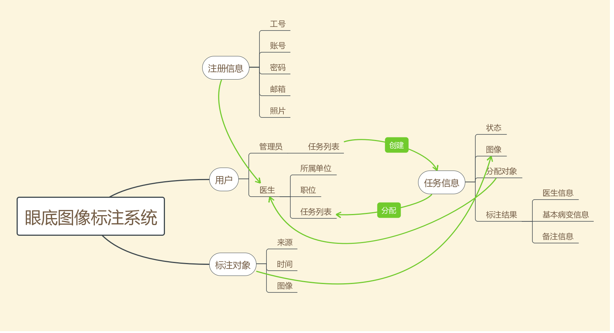
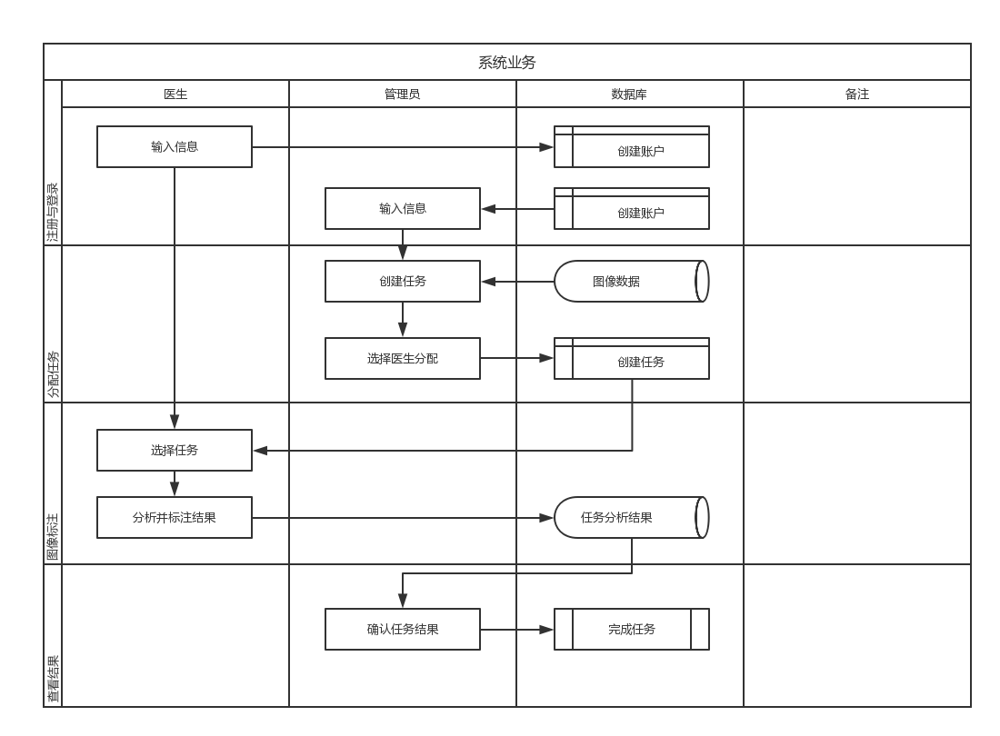
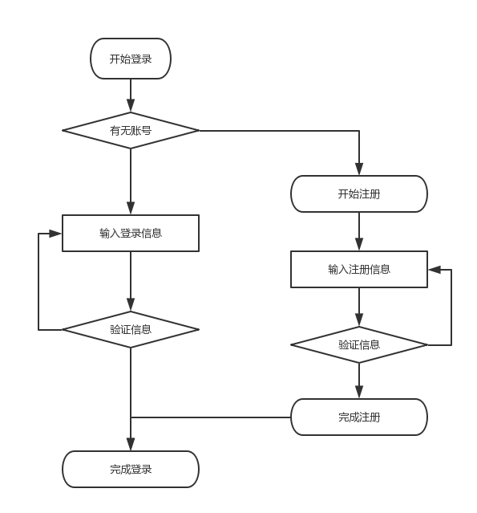
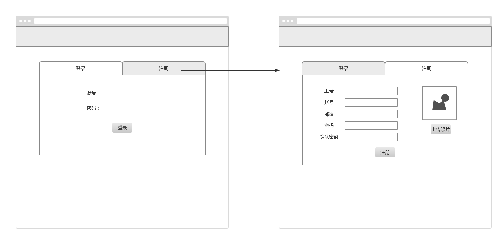
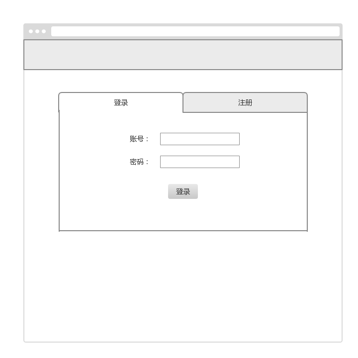
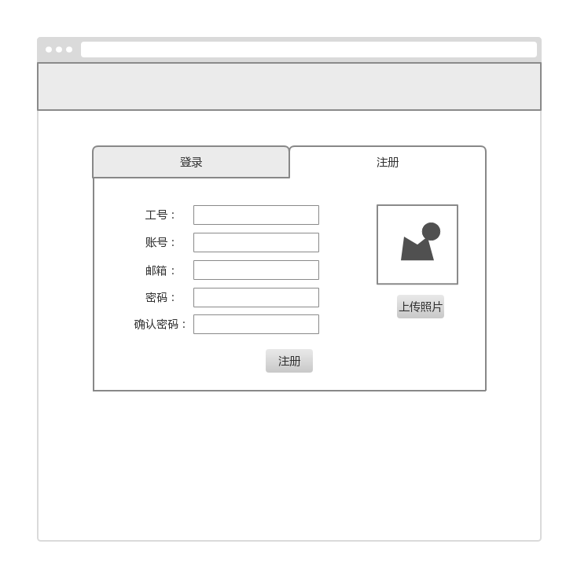

# 产品需求文档

**创建者：**徐海洋

**最近修改日期：**2018年4月15日 星期日

| 目标版本         | 1.0                        |
| ---------------- | -------------------------- |
| **成品**         | 用于眼底图像标注的网页应用 |
| **文档状态**     | 草稿                       |
| **文档所有者**   | TheYelda                   |
| **设计人员**     | 徐海洋                     |
| **开发人员**     |                            |
| **质量保证人员** |                            |

## 目标与背景

### 目标

- 我们的目标是为眼科医院的眼底图像标注任务构建一个网页应用。
- 管理员可以在网页上查看和分配任务，医生也可以完成对图像的分析与标注。

### 背景与战略协调性

院方需求。

### 客户研究

- 阅片相同功能建议
- 分级系统病变分类

### 假设

- 管理员是默认注册的账号。

## 需求

### 用户故事

- 管理员让两个医生来对一张图像进行分析。
- 医生仔细检查眼底图像并判断病变情况。
- 管理员看到医生的分析结果。

（下面表格亦即 **Product Backlog** 产品特性）

| #    | 名称     | 描述                             | 优先级 | 备注 |
| ---- | -------- | -------------------------------- | ------ | ---- |
| 1    | 注册     | 系统常规功能                     | 高     |      |
| 2    | 登录     | 系统常规功能                     | 高     |      |
| 3    | 查看任务 | 医生可以查看被分配的任务列表     | 中     |      |
| 4    | 查看图像 | 医生可以查看任务图像的基本信息   | 中     |      |
| 5    | 输入结果 | 医生可以输入任务图像的分析结果   | 中     |      |
| 6    | 创建任务 | 管理员可以创建任务并分配给医生   | 中     |      |
| 7    | 查看结果 | 管理员可以查看分析结果并完成任务 | 中     |      |
| 8    | 处理图像 | 医生可以处理与调节图像的视觉效果 | 低     |      |
| 9    | 标注图像 | 医生可以在图像上进行标注         | 低     |      |

## 产品架构

### 信息架构图

该系统主要包含三大类对象：用户、任务、图像。

### 业务流程图

下面是系统业务的泳道图，用来反映业务流程。该流程图涉及到医生、管理员和数据库三个主体；在不同的阶段，每个主体都有其相应的业务，并用箭头来表示各个业务之间的先后次序。

### 任务流程图

下面是注册与登录的任务流程。

### 页面流

下面是注册与登录的页面流。

## 交互与设计

### UI 设计

以下为线框原型，详细的交互说明与视觉规范见《产品设计文档》。

| 描述         | 登录界面                       |
| ------------ | ------------------------------ |
| **原型设计** |  |
| **备注**     |                                |

| 描述         | 注册界面                       |
| ------------ | ------------------------------ |
| **原型设计** |  |
| **备注**     |                                |

## 问题与不需要做的事情

### 问题

下面是理解文档时出现的问题。

| 问题 | 结果 |
| ---- | ---- |
|      |      |
|      |      |

### 不需要做的事情

- 暂无